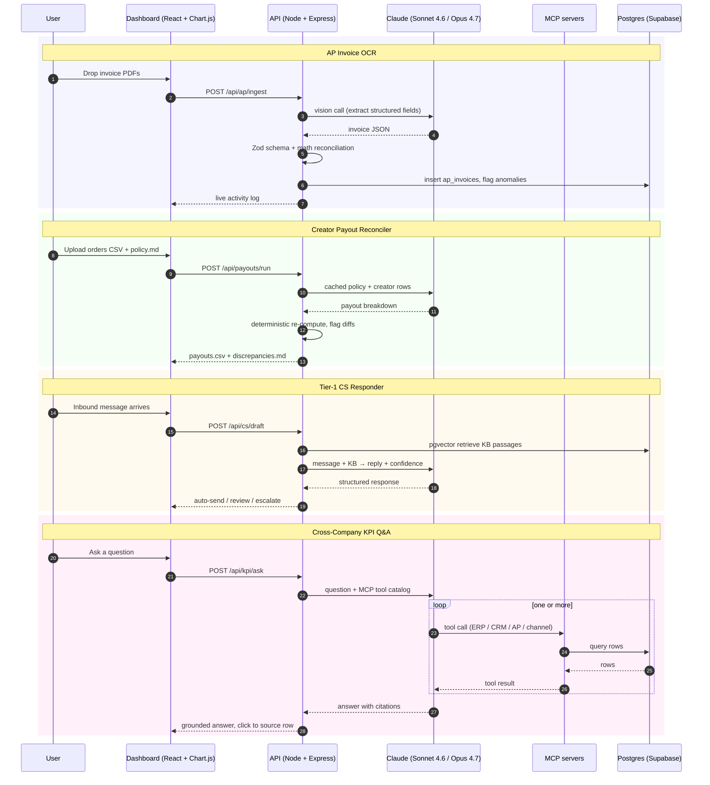

<picture>
  <source media="(prefers-color-scheme: dark)"  srcset="assets/banner-dark.svg"  type="image/svg+xml">
  <source media="(prefers-color-scheme: light)" srcset="assets/banner-light.svg" type="image/svg+xml">
  <source media="(prefers-color-scheme: dark)"  srcset="assets/banner-dark.png">
  <source media="(prefers-color-scheme: light)" srcset="assets/banner-light.png">
  
</picture>

[](https://github.com/Builder106/Helm/actions/workflows/deploy.yml)
[](https://helm-ops.vercel.app)
[](https://nodejs.org/)
[](https://react.dev/)
[](https://www.anthropic.com/claude)
[](https://modelcontextprotocol.io/)
[](https://supabase.com/)
[](#license)

> **Helm is a Claude + MCP executive co-pilot for small-and-mid-market business operations.** Four back-office workflows — AP-invoice OCR, creator-payout reconciliation, Tier-1 customer-service responses, and cross-company KPI Q&A — running end-to-end with measured cost and accuracy per task. The dashboard is the demo.

**Live dashboard:** _coming online — see the [scope contract](docs/scope.md) for what ships in v1._

## The headline finding

> _Placeholder until measured. The README banner finding is a contract: the project is not "done" until the measurement supports it. See [`CLAUDE.md`](CLAUDE.md) for the discipline around this number, and [`data/measurements/`](data/measurements/) for the reproducibility scripts that will produce it._

## What this is

Helm is a portfolio project: a working sketch of what an AI/automation team would actually build inside a growing SMB. The Handshake postings that motivated it — Smart Circle International, FHI Heat, Source Creative — all describe the same shape of work: a Claude-powered layer that sits between human operators and their messy stack of business systems, runs the repetitive parts, and surfaces decisions for humans. Helm is that layer, built against synthetic stand-ins for the systems and measured against hand-labeled ground truth.

The lane is **agent/automation**, not applied ML. There is no novel model here. The engineering contribution is the orchestration — four MCP servers, a Claude-vision OCR pipeline, a prompt-cached policy reasoner, and a citation-grounded executive Q&A path — and the per-workflow cost/accuracy measurement that lets the README make a defensible claim.

## How it works



## The four sub-features

Each panel of the dashboard maps to one sub-feature, and each sub-feature ships with a measurement. The full contract — workflow, schema, and exact measurement protocol — lives in [`docs/scope.md`](docs/scope.md).

| Sub-feature | Stack | Measurement |
|---|---|---|
| **AP Invoice OCR** | Claude vision, Zod, Postgres | Line-item accuracy on 200-invoice holdout, USD/invoice, p50/p95 latency |
| **Creator Payout Reconciler** | Claude with prompt-cached policy, deterministic re-computer | Exact-match rate vs. hand-computed ground truth on 50-creator fixture |
| **Tier-1 CS Responder** | pgvector retrieval, Claude structured output, confidence gating | Auto-response rate, precision; escalation recall |
| **Cross-Company KPI Q&A** | Anthropic Citations API, four custom MCP servers | Citation accuracy, tool-routing precision on a 10-question battery |

## Architecture

```
Helm/
├── front/        React 19 + Vite + Chart.js + Tailwind — the dashboard
├── back/         Node 22 + Express 5 — API surface, agent orchestration
├── mcp/          Four MCP servers — one per data source (erp, crm, ap, channel)
│   ├── erp/
│   ├── crm/
│   ├── ap/
│   └── channel/
├── data/
│   ├── generators/   Seed-driven synthetic-data generators
│   ├── fixtures/     Versioned generated fixtures with labels
│   └── measurements/ Reproducibility scripts for every README number
├── e2e/          Playwright + playwright-bdd: QA suite + demo-recording suite
├── docs/         scope.md, architecture.md, anything else durable
├── assets/       Banner SVGs, logo, demo recordings
└── .github/workflows/  CI + deploy
```

The deeper architectural notes — when to use Sonnet vs. Opus, the MCP-server protocol Helm uses, the prompt-cache layout for each path — live in [`docs/architecture.md`](docs/architecture.md) as those decisions land.

## Why this exists

Three Handshake postings (Smart Circle, FHI Heat, Source Creative) describe the same operational gap: small companies with real revenue but no in-house AI/automation team, drowning in invoice processing, creator-payout math, customer-service triage, and "where do I find that number" executive questions. Helm is a sketch of what shipping that team's first quarter of work would look like — with the constraint that every claim in the README has to be backed by a re-runnable measurement, not a generated screenshot.

This is a portfolio piece, not a product. The synthetic data is synthetic; the workflows are real.

## Running it locally

_Setup instructions land alongside the first working sub-feature. See [`CONTRIBUTING.md`](CONTRIBUTING.md) for dev-environment requirements and the conventions this repo follows._

## Demos

_Recorded walkthroughs land here once the dashboard renders end-to-end. The recording pipeline is the Playwright + playwright-bdd demo suite described in the global `~/.claude/CLAUDE.md`._

## Project status

| Phase | Status |
|---|---|
| Scaffold | ✅ |
| Synthetic-data generators (seed=1 committed) | ✅ |
| Sub-feature 1 — AP Invoice OCR | 🟡 mock pipeline runnable end-to-end; real-Claude extractor pending |
| Sub-feature 2 — Creator Payout Reconciler | ⬜ |
| Sub-feature 3 — Tier-1 CS Responder | ⬜ |
| Sub-feature 4 — Cross-Company KPI Q&A | ⬜ |
| Banner SVGs + demo videos | ⬜ |
| Deployed dashboard | ⬜ |

## License

MIT. See [`LICENSE`](LICENSE).
